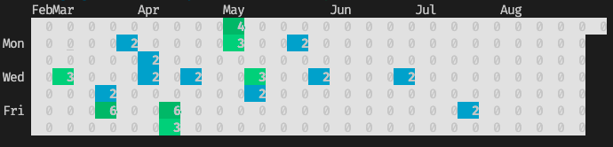

# gitchart

`gitchart` is a command line tool to show git commits distribution in the last several months.




## Install

```shell
go get github.com/chenlujjj/gitchart
```

## Usage

```
$ gitchart -h

Usage of gitchart:
  -month int
        since how many months ago (default 6)
  -self
        only count commits by myself. This flag would override 'username' flag
  -username string
        count commits by the 'username' author. If not set, would count all authors' commits
```
